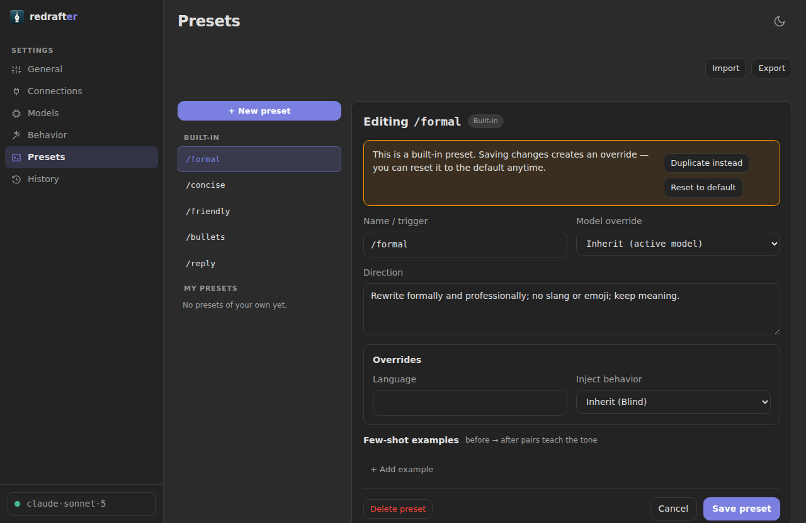
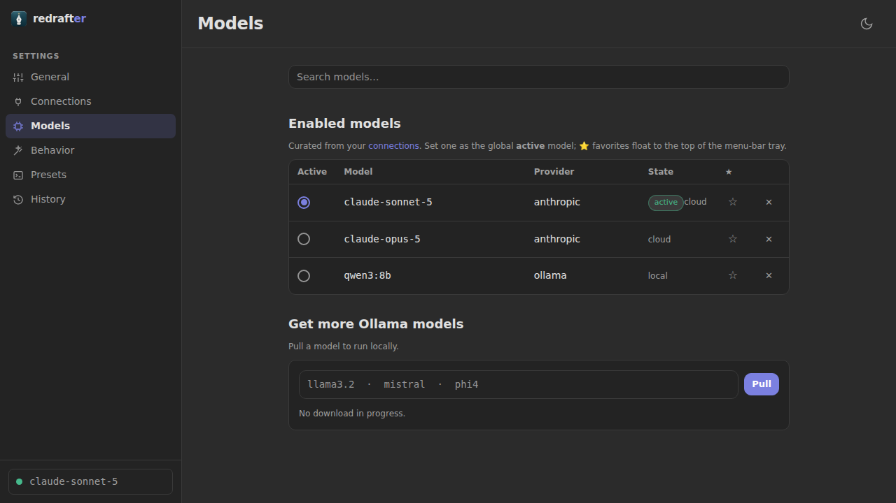
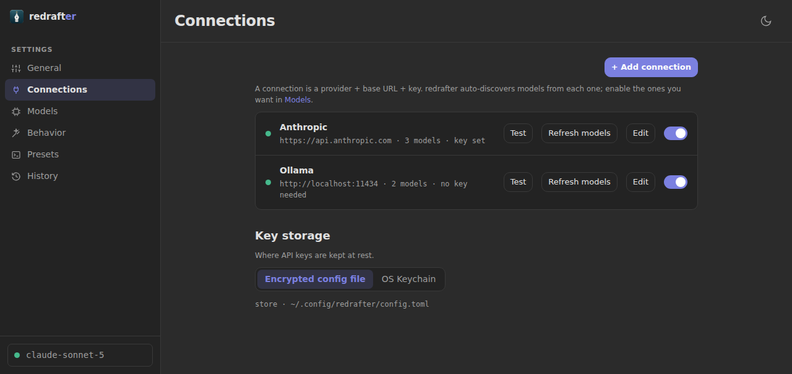
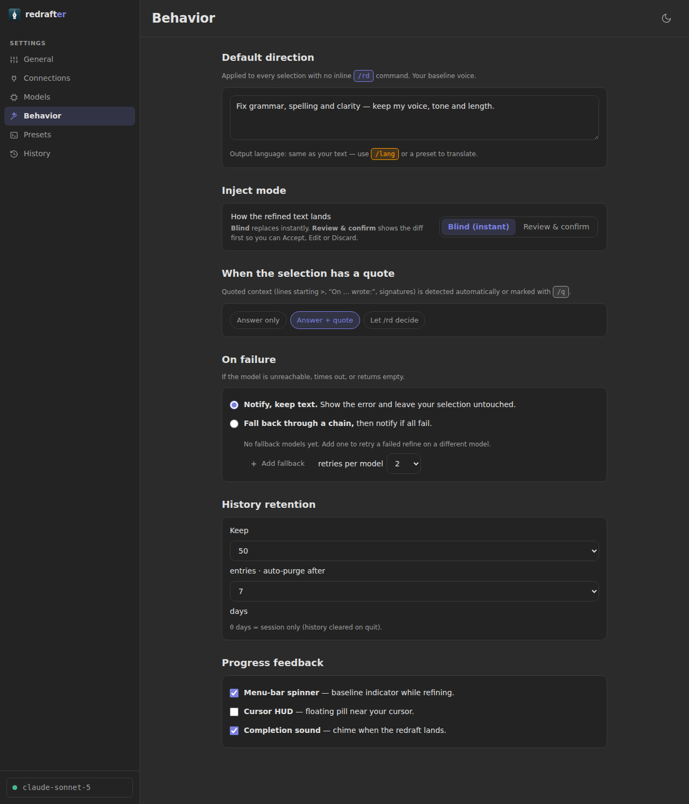

<p align="center">
  
</p>

<h1 align="center">redrafter</h1>

<p align="center">
  Select text anywhere. Press a hotkey. Get a better version back, in place.
</p>

<p align="center">
  <a href="https://github.com/Tapnetix/redrafter/releases/latest"></a>
  <a href="LICENSE"></a>
</p>

---

<p align="center">
  
</p>

redrafter is a menu-bar app that refines the text you're already writing: in
Slack, in your mail client, in a text field on a web page. Select it, press
`Ctrl+Alt+R`, and the polished version replaces your selection. No window to
switch to, no copy-paste round trip.

It talks to whichever model you point it at: a local one through
[Ollama](https://ollama.com), or Anthropic Claude, Google Gemini, or any
OpenAI-compatible endpoint. Your text goes to that provider and nowhere else;
with Ollama it never leaves the machine.

## Install

Grab a build from the [latest release](https://github.com/Tapnetix/redrafter/releases/latest).

| Platform | File | Notes |
|---|---|---|
| macOS (Apple Silicon) | `.dmg` | Signed with a Developer ID and notarized |
| Linux | `.AppImage`, `.deb`, `.rpm` | Requires glibc 2.39+ (Ubuntu 24.04, Debian 13) |
| Windows | `-setup.exe` | |

On first launch macOS will ask for **Accessibility** permission. redrafter needs
it to read your selection and type the replacement back; there is no way to do
that without it. Nothing else is requested.

## Directing the model

With no instructions, redrafter applies a light grammar-and-clarity polish that
preserves your voice. It won't summarize you or change what you meant.

When you want something specific, say so inside the selection itself:

| Command | Meaning |
|---|---|
| `/rd <direction>` | An instruction: `/rd make it formal and much shorter` |
| `/m <message>` | Marks where your own message starts |
| `/q <quote>` | Text you're replying to (usually detected automatically; this overrides) |
| `/lang <code>` | Write the result in another language: `/lang de` |

They combine. Selecting this:

```
/rd keep it warm but brief /lang de /m sorry for the delay, we shipped Friday
```

sends the direction and the language, treats only the last part as your message,
and pastes back a warm, brief German reply.

### Presets

A preset is a saved direction with a name. Five ship with the app (`/formal`,
`/concise`, `/friendly`, `/bullets`, `/reply`), and you can add your own,
override a built-in, or reset it back. Each preset can pin its own model and
override the language or inject mode.

```
/formal we good with the release plan i think, no delays i hope
```

## Configuration

Everything is in the app window; the menu-bar icon opens it.

**Connections**: one entry per provider endpoint. Anthropic, Gemini, Ollama, or
any OpenAI-compatible URL. Each connection is tested before it's saved, and its
model list is discovered from the endpoint rather than hard-coded. If you use
Claude Code, one button imports its login instead of asking for an API key.

**Models**: pick which discovered models are available and which one is active.

**Behavior**:

- *Inject mode*: **blind** pastes the result straight back; **review & confirm**
  opens a panel first so you can edit or discard it.
- *On failure*: retry count, a fallback chain of models to try in order, and
  whether to notify you.
- *Quote handling*: when you're replying to something, whether the result is
  the answer only, the answer with the quote kept, or left to `/rd` to decide.
- *History retention*: how many past refines to keep.

**History**: every refine is recorded. Search it, copy a result, restore the
original, or re-run one through whatever model is active now.

**General**: hotkey (rebindable, with conflict detection), theme, launch at
login, Accessibility status.

<details>
<summary>More screens</summary>

<p align="center"></p>
<p align="center"></p>
<p align="center"></p>

</details>

## Where your keys live

API keys are encrypted at rest with AES-256-GCM before they touch disk. The
master key is 32 random bytes in a sibling `0600` file.

That keeps keys out of the plaintext config and out of ad-hoc backups, but it is
honest about its limit: an attacker who already has your OS user account has the
master key too. On macOS you can opt into the **system Keychain** instead, which
does defend against that.

Everything else (settings, presets, history) is SQLite in the app's own data
directory. There is no telemetry and no account.

## Building from source

You'll need Rust (stable), Node 20+ (CI builds on 24), and pnpm. On Linux
you'll also need Tauri's system dependencies; see
[the Tauri prerequisites](https://v2.tauri.app/start/prerequisites/), or read
[`.ci/Dockerfile.linux`](.ci/Dockerfile.linux), which lists exactly what CI
installs.

```bash
git clone https://github.com/Tapnetix/redrafter.git
cd redrafter/app
pnpm install
pnpm tauri dev          # run it
pnpm tauri build        # produce installers for the current platform
```

## Tests

```bash
cargo nextest run --workspace   # Rust: 879 tests
cd app && pnpm test             # frontend units: 277 tests
cd app && pnpm e2e              # Playwright, IPC-mocked: 83 tests
```

The Playwright suite drives the real React app against a mocked Tauri IPC layer,
so it's broad but proves nothing about the Rust side being wired up.
[`e2e-real/`](e2e-real/) is the harness that drives the actual packaged binary
through WebDriver, on a real desktop session.

`cargo nextest` rather than `cargo test` is deliberate: the GTK tray
initialization crashes when several tests share a process, so every test needs
its own.

## Layout

```
app/            Tauri app: Next.js frontend (app/src) + Rust backend (app/src-tauri)
crates/
  llm-provider  Provider clients: Anthropic, Gemini, Ollama, OpenAI-compatible
  text-inject   Capture and inject text per platform (AX-first, clipboard fallback)
docs/wireframes Interactive HTML prototypes of every screen
e2e-real/       Real-binary acceptance harness
.ci/            Linux CI image and build script
```

`text-inject` is the interesting one. It goes through the platform accessibility
API first (macOS AX, Windows UI Automation, X11/Wayland tools on Linux), verifies
the write actually landed, and only then falls back to the clipboard, always
saving and restoring whatever you had on it. Refining a sentence should not cost
you what you copied five minutes ago.

## Status

Early development, and macOS-first: that's where it's used daily and where the
platform work is most complete. Linux and Windows builds are produced and tested
on every commit, but have had far less real-world use.

## License

MIT. See [LICENSE](LICENSE).
